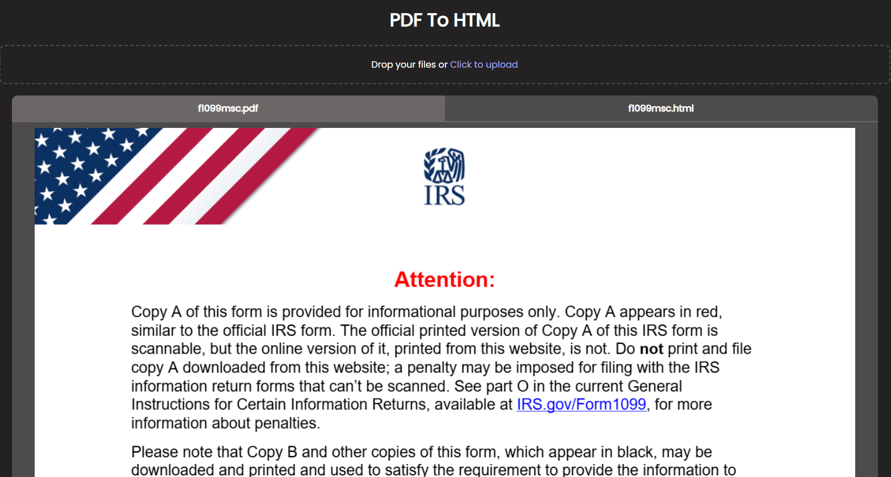

# HTML to PDF



## Description

This project allows you to upload a PDF file, view the PDF rendered as an image on the page, and see its content converted into HTML. It leverages `pdf.js` for rendering the PDF and extracting text to display it in HTML format.

### Features:

- **Upload PDF**: Users can upload a PDF file.
- **Render PDF as Image**: The PDF is rendered as an image on the canvas, allowing users to view the PDF content.
- **PDF to HTML Conversion**: The text content of the PDF is extracted and displayed in HTML format. This is done in the browser with no api calls.

## Progress

- **Uploaded PDF File**: The user can select and upload a PDF file.
- **Rendered as Image**: The PDF is displayed as an image using the `pdf.js` library, rendered to a `<canvas>`.
- **HTML Conversion**: The text content from the PDF is extracted and displayed on the webpage using HTML elements.

## TODO

1. **Implement Drag-and-Drop Upload**: Allow users to drag and drop the PDF file to upload it.
2. **View Multiple Pages**: Implement functionality to navigate between different pages of the PDF and render them as images.
3. **PDF to HTML Conversion**: Complete the PDF-to-HTML conversion process by ensuring text is displayed accurately with proper formatting.

## Installation

### Prerequisites

- Ensure you have a modern web browser that supports HTML5 and JavaScript.
- No server-side installation is required; this project is client-side only.

### Steps to Run:

1. Clone the repository (if applicable):
   ```bash
   git clone https://github.com/huncholane/pdftohtml.git
   ```
2. Open the html file or run with a server like
   ```bash
   python3 -m http.server 9000
   ```
